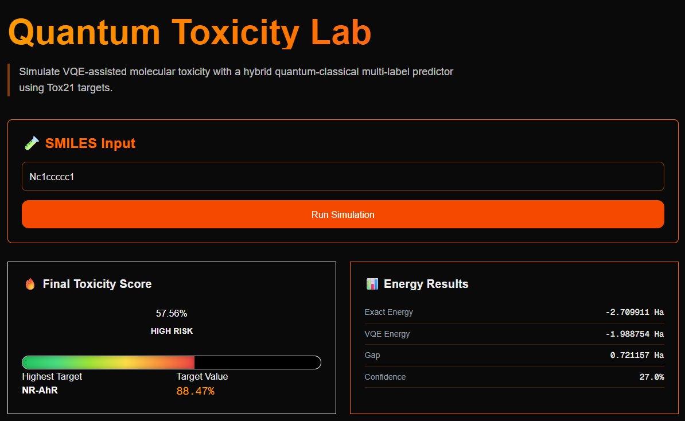
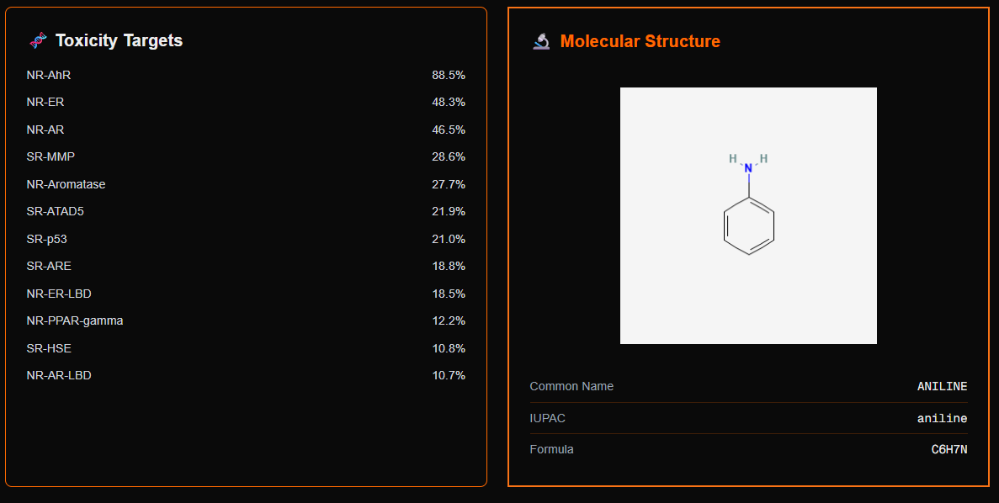

# 🚀 Quantum-Powered Drug Discovery Platform

A full-stack **Quantum + AI-powered molecular simulation platform** that combines **Variational Quantum Eigensolver (VQE)** with **machine learning-based toxicity prediction**.

This project bridges **quantum computing, cheminformatics, and AI**, enabling users to simulate molecular energy and predict toxicity behavior in a single system.

---

## 🧠 Project Highlights

- ⚛️ Quantum Simulation (VQE) using Qiskit
- 🤖 Multi-label Toxicity Prediction (Tox21 dataset)
- 🧪 Molecular Feature Engineering (RDKit + Quantum features)
- 📊 1033-dimensional feature vectors
- 📈 Average Accuracy ~80–88% (ROC-AUC optimized)
- 🌐 Full Stack App (React + FastAPI + MongoDB)

---

## 🎯 Problem Statement

Traditional molecular simulation and drug discovery:
- Are computationally expensive
- Require specialized tools
- Lack integration with AI prediction systems

👉 This project solves it by combining:
- Quantum simulation (VQE)
- Machine learning prediction
- Interactive visualization

---

## ⚙️ System Architecture
```
Frontend (Next.js + Tailwind)
        ↓
FastAPI Backend
        ↓
├── Quantum Engine (Qiskit VQE)
├── ML Engine (XGBoost Multi-label Model)
├── Feature Engine (RDKit + Quantum Features)
└── MongoDB (Caching)
```

---

## 🔬 Core Features

### ⚛️ 1. Quantum Simulation (VQE)

- Computes molecular ground state energy
- Uses:
  - EfficientSU2 Ansatz
  - COBYLA optimizer
- Supports:
  - Local simulator
  - IBM Quantum backend

---

### 🤖 2. Machine Learning Prediction

- Dataset: **Tox21 (7796 samples)**
- Features: **1033-dimensional vectors**
- Model: **XGBoost (12 independent classifiers)**

#### Targets:
- NR-AR, NR-AR-LBD, NR-AhR, NR-Aromatase
- NR-ER, NR-ER-LBD, NR-PPAR-gamma
- SR-ARE, SR-ATAD5, SR-HSE, SR-MMP, SR-p53

---

## 📊 Model Performance

| Metric       | Value          |
|--------------|----------------|
| Accuracy     | ~0.80 – 0.88   |
| ROC-AUC      | ~0.85 – 0.92   |
| Dataset Size | 7796 samples   |
| Features     | 1033           |

---

## 🧪 3. Feature Engineering

Generated using:
- RDKit descriptors
- Molecular fingerprints
- Quantum-derived features
```
Feature Vector Size: 1033
```

---

## 🧬 4. Molecular Visualization

- Structure rendering from SMILES
- Energy comparison:
  - Exact Energy
  - VQE Energy
  - Energy Gap
  - Confidence Score

---

## ⚡ 5. Smart Caching

- MongoDB stores:
  - Simulation results
  - Predictions
- Reduces recomputation time significantly

---

## 📦 Installation

### 1. Clone Repository
```bash
git clone https://github.com/CHVivek7/Final-Project.git
cd Final-Project
```

### 2. Frontend Setup
```bash
npm install
npm run dev
```

### 3. Backend Setup
```bash
cd backend
pip install -r requirements.txt
```

Create `.env` file:
```env
MONGODB_ATLAS_URI=your_mongodb_uri
IBMQ_API_TOKEN=your_ibm_token
```

Run backend:
```bash
python main.py
```

---

## 🚀 Usage

### 🧪 Run Simulation
1. Enter molecule (SMILES format)
2. Select quantum mode
3. View:
   - Energy values
   - Confidence score

### 🤖 Predict Toxicity
1. Enter molecule
2. Get predictions across 12 toxicity endpoints

---

## 📸 Demo Outcome





---

## 📄 License

This project is licensed under the [MIT License](LICENSE).
